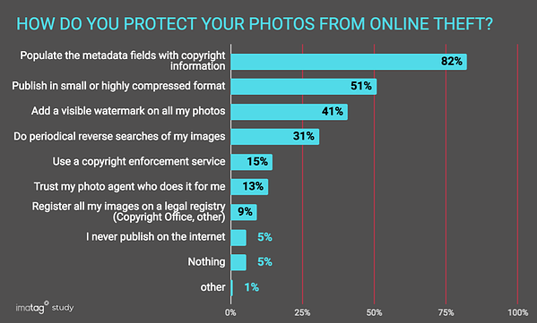
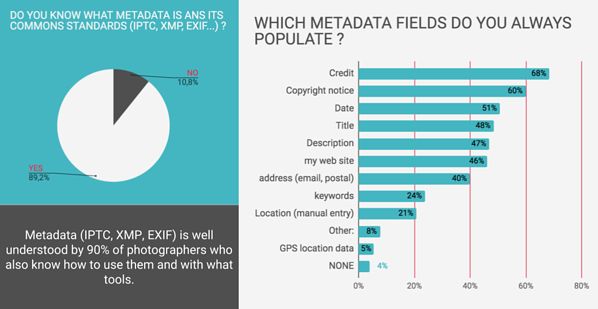

# 14/06/2022 - Premier Meeting avec l’équipe

Created: June 14, 2022 9:28 AM
Tags: Daily

# 👨🏻‍🤝‍👨🏻 Meeting

On est revenu en détail sur ce que l’on attendait de moi pendant ce stage :

> L’objectif est de chercher, et idéalement trouver, **une solution pour tracer les médias payant sortant du site** Uncove dans le but de pouvoir “analyser” un média pour retrouver l’utilisateur ayant payé ce média.

Pour cela il faut également prendre en compte qu’il est possible de prendre un screen-shot d’un média, et donc il faudrait que la solution soit “Screen-shot proof”.

L’outil principal qui m’a été attribué pour parvenir à mon objectif est une page **Confluence**, qui va me servir de **Documentation** sur tout mon parcours de recherche et de test.

**Tâche du jour :**

- [ ] Mettre en place un **WorkFlow** efficace et en harmonie avec les outils utilisés par l’équipe.
- [ ] Commencer à **chercher** et se renseigner sur ce qui est fait et sur des potentielles communautés sur le sujet etc…

<!--truncate-->

# 📒 Mise en place du WorkFlow

Ce que j’appelle ici **WorkFlow** va être les outils et la routine que je vais m’imposer pour être le plus efficace possible et pouvoir me concentrer sur la rechercher et la reflexion tout en étant capable de **résumer et documenter** mon travail proprement.

Pour ce faire j’utilise en outil principal **Notion.**

Notion est un site internet spécialisé dans la prise de note, il a beaucoup d’avantage et est très utilisé aujourd’hui. Il est ultra versatile et à un double avantage dans mon travail.

Etant en stage dans le cadre de mes études, un rapport est demandé pour la fin de la période d’activité, mais au format Blog. J’ai découvert récemment un outils nommé **_Docusaurus_** permettant de générer des sites internet grâce à du Markdown.

Je prend donc des notes type **journal** tout les jours sur **Notion** qui portent sur mes tâches et mon travail chez Uncove.

J’exporte ensuite ces journaux au format Markdown et les upload sur mon site Docusaurus qui s’occupe de les transformer en article de blog.

Cela me permet de me concentrer sur le contenu plutôt que sur la mise en forme.

Les notes me serviront ensuite à rédiger de manière plus professionnel mon avancée sur le sujet sur ma page **Confluence**.

# 📜 Début des recherches

Je ne connais vraiment pas le sujet et j’ai une connaissance très limité dans les données des médias. Je part donc proche de 0, et je vais devoir apprendre à chercher et trouver des points de départs.

La première étape va être de résumer la solution avec des fonctionnalités / mots-clés indispensable et importantes.

## 🖼 Métadonnées des Images

### 🔍 **How work image metadata**

**[What is image metadata? - Definition from WhatIs.com](https://www.techtarget.com/whatis/definition/image-metadata#:~:text=Some%20metadata%20is%20generated%20automatically,directly%20on%20some%20digital%20cameras.)**

> Les métadonnées d'image sont des informations textuelles relatives à un fichier image qui sont incorporées dans le fichier ou contenues dans un fichier séparé qui lui est associé.

> Les métadonnées d'image incluent des détails pertinents pour l'image elle-même ainsi que des informations sur sa production. Certaines métadonnées sont générées automatiquement par l'appareil qui capture l'image. Des métadonnées supplémentaires peuvent être ajoutées manuellement et éditées via un logiciel dédié ou un logiciel d'édition d'image général tel que GIMP ou Adobe Photoshop. Les métadonnées peuvent également être ajoutées directement sur certains appareils photo numériques.

> Les métadonnées d'image peuvent être très utiles pour cataloguer et contextualiser les informations visuelles. De nombreux artistes visuels trouvent les fonctionnalités utiles pour fournir des données sur eux-mêmes et leurs images.

> Les métadonnées d'image peuvent également **aider à protéger la propriété intellectuelle**. Il est important de noter, cependant, que **les informations sur le droit d'auteur ne constituent pas une protection adéquate** car **elles peuvent facilement être supprimées**. De plus, comme pour d'autres types de contenu, la **sécurité des métadonnées peut être fastidieuse**, nécessitant des **mesures supplémentaires pour sécuriser les métadonnées** d'image et les protéger contre tout accès non autorisé.

> Les trois principales catégories de métadonnées d'image sont :
>
> - Les **métadonnées techniques** sont généralement **générées automatiquement par la caméra**. Il comprend les détails et les paramètres de l'appareil photo tels que l'ouverture, la vitesse d'obturation, le nombre ISO, la profondeur focale, les points par pouce (DPI). D'autres métadonnées générées automatiquement incluent la marque et le modèle de l'appareil photo, la date et l'heure de création de l'image et l'emplacement GPS où elle a été créée.
> - Les **métadonnées descriptives** sont généralement **ajoutées manuellement via un logiciel d'imagerie** par le photographe ou une personne qui gère l'image. Il comprend le nom du créateur de l'image, des mots-clés liés à l'image, des légendes, des titres et des commentaires, parmi de nombreuses autres possibilités. Des métadonnées descriptives efficaces sont ce qui rend les images plus facilement consultables.
> - Les **métadonnées administratives sont généralement ajoutées manuellement**. Il comprend les **droits d'utilisation et de licence**, les **restrictions de réutilisation**, les **coordonnées du propriétaire de l'image**.

> _Il existe plusieurs formats normalisés de métadonnées, notamment : Information Interchange Model (IPTC), Extensible Metadata Platform (XMP), EXchangable Image File (Exif), Dublin Core Metadata Initiative (DCMI) et Picture Licensing Universal System (PLUS)._

**[How to Work With Image Metadata - TurboFuture](https://turbofuture.com/computers/How-to-Work-with-Image-Metadata)**

[Metadata ordered list](https://www.notion.so/2d3b476c508a4a149321314288ac8c2e)

Il y existe une **photo référence** pour les normes de Metadata chaque année : [https://iptc.org/std/photometadata/examples/IPTC-PhotometadataRef-Std2021.1.jpg](https://iptc.org/std/photometadata/examples/IPTC-PhotometadataRef-Std2021.1.jpg)

> **L'IPTC Photo Metadata TechReference**
> IPTC fournit une version lisible par les machine de la spécification qui peut être consommée directement par des outils logiciels. Nous l'appelons IPTC Photo Metadata TechReference.

> Le TechReference est un **_data object_** contenant tous les détails des spécifications techniques des métadonnées photo IPTC dans les formats JSON et YAML faciles à utiliser.

> IPTC a publié une documentation riche sur le **_data object_** TechReference et les **_data object_** eux-mêmes peuvent être téléchargés à partir du site IPTC en par les membres de l'IPTC et d'autres parties intéressées :
>
> - [Documentation on the TechReference data object](https://iptc.org/std/photometadata/documentation/techreference/)
> - The standard version 2021.1 data object in JSON format: [https://iptc.org/std/photometadata/specification/iptc-pmd-techreference_2021.1.json](https://iptc.org/std/photometadata/specification/iptc-pmd-techreference_2021.1.json)
> - The standard version 2021.1 data object in YAML format: [https://iptc.org/std/photometadata/specification/iptc-pmd-techreference_2021.1.yml](https://iptc.org/std/photometadata/specification/iptc-pmd-techreference_2021.1.yml)

> **Pour les créateurs et éditeurs de photos : comment modifier les champs de métadonnées**

> Il est important de comprendre que les métadonnées de photo IPTC sont en fait intégrées dans le fichier binaire de l'image. Vous ne pouvez pas ajouter de balises HTML ou de balisage [schema.org](http://schema.org/) pour ajouter ces métadonnées. Mais n'ayez crainte, vous pouvez utiliser certains outils pour modifier les champs. Nous maintenons une liste d'outils pour éditer les métadonnées de photos IPTC. Voici quelques-uns des principaux outils que nous couvrons :
>
> - Adobe Photoshop et Adobe Lightroom
> - L'outil gratuit de manipulation d'images GIMP - voir leurs docs
> - Outils de photographie tels que ACDSee Pro, FotoStation, PhotoMechanic et le système de gestion des actifs numériques Extensis Portfolio
> - Pour les plus techniques, la ligne de commande ExifTool peut être exécutée dans un script pour mettre à jour plusieurs images en même temps.
>
> Chacun de ces outils vous permettra de modifier les champs d'une manière légèrement différente. Il existe généralement une sorte de "panneau de propriétés" ou de "fenêtre de métadonnées" qui vous permet d'afficher et de modifier tous les champs de métadonnées intégrés.

> **Pour les développeurs et les administrateurs de site : comment s'assurer que les champs sont conservés dans les images de votre site**

> Le système de gestion des actifs numériques, le système de gestion de contenu, le système de gestion d'images ou le réseau de diffusion de contenu de votre site peuvent supprimer les champs de métadonnées intégrés. Certains systèmes le font avec les meilleures intentions, pensant que cela économisera quelques octets de bande passante, mais la suppression des métadonnées enfreint en fait les droits des titulaires de droits d'auteur et peut même être illégale dans certains pays.

> Vous devez utiliser un DAM et un CMS qui respectent et conservent les métadonnées intégrées IPTC et XMP, et assurez-vous que toutes les options de configuration qui suppriment les métadonnées sont désactivées. Vous devrez peut-être également examiner les plugins de recadrage et de manipulation d'images pour votre CMS - par exemple, la bibliothèque WordPress ImageMagick conserve les métadonnées intégrées, mais d'autres les suppriment.

### **🔍 Lock image metadata for copyright**

**[Can I "lock" copyright metadata in an image? - Photography ...](https://photo.stackexchange.com/questions/21379/can-i-lock-copyright-metadata-in-an-image)**

**Question**

> I'm going to be distributing some of my images as TIFF files and want to put my copyright and contact information into the metadata for the images in a way that prevents it being stripped or altered by third parties. At the moment I'm using Photoshop CS5 and inserting the information using Bridge. Is there a method for locking the metadata that anyone can recommend?

**Answers**

> Anyone with an editor can open a TIFF and save it again without the metadata. I don't think there is any way to lock the metadata from being stripped out. You could look at digital watermarking, such as [Digimarc](http://www.digimarc.com/technology/about-digital-watermarking)

‼ **Digimarc rentre totalement dans le genre de solution cherchée, à creuser.**

---

> The only method I've found is to use a very old technique. It was used during the American Revolution by none other than George Washington himself, as well as his compatriots. It's known as STEGANOGRAPHY. There are many free programs available through a Google search. Pick one that suits you.

> These programs add small files to the image itself. It can be text, QR code, another image such as a copyright, or whatever else you want to put into it. These tiny files are "embedded" into the image, not attached as Metadata is added as a sidecar. It cannot be seen or removed unless you have the same program and password which YOU add when YOU create it.

> I've tested it on many Photo-Hosting sites and Google Plus Photos.

> Create, upload, then download from the uploaded image site. Open and run your steganography program to locate the hidden text/files and reveal the contents which were missed by website strippers & rippers! Enjoy!

**[Professionals' tips on how to protect your images from online ...](https://blog.imatag.com/professionals-tips-protect-images-from-theft)**

> En février 2018, Imatag a mené une enquête en ligne auprès de photographes du monde entier :

> La grande majorité des réponses provenaient de photographes professionnels qui dépendent des frais de licence pour leurs images afin de poursuivre leur métier.

> **Plusieurs solutions**

> Quand aux méthodes qu'ils utilisent pour protéger leurs photos, ils répondent majoritairement qu'ils utilisent plusieurs solutions. Concentrons-nous donc sur les métadonnées utilisées :

> **Alors que faire ?**
> Vous devez publier vos images sur le web pour votre travail. Sachez qu'ils peuvent être volés. Lorsqu'ils le seront, vos métadonnées disparaîtront, votre crédit visible aura été rogné, vos filigranes effacés et la résolution améliorée, si nécessaire. Tout ce qui restera de votre image, ce sont des pixels anonymes bruts.

> C'est pourquoi il vous faut :
>
> - Un système de détection fiable qui peut reconnaître toutes vos images même modifiées.
> - Une alerte automatisée pour vous informer quand vos images sont republiées et où (imprimé et en ligne).
> - Un système qui réunit automatiquement votre image avec ses métadonnées et ses pixels d'origine.

> Seul le filigrane invisible d'Imatag offre cette protection complète à plusieurs niveaux. Imperceptiblement caché dans les pixels, il n'est ni détecté ni effaçable par l'intelligence artificielle et peut reconnaître avec précision n'importe quelle image, 100% du temps. Parmi les solutions existantes sur le marché, Imatag est la plus performante.

> Ce service n'empêche pas le vol d'images mais il alerte les photographes et les agences lorsque leurs images sont en ligne. C'est le seul moteur de recherche inversé conçu pour renvoyer non seulement l'image mais aussi son crédit et ses métadonnées.
