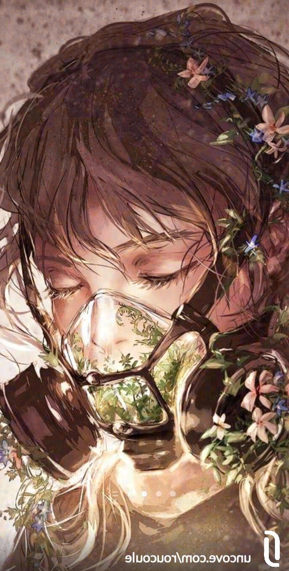

# Test de la solution Blind_watermark :

Solution Github :
https://github.com/guofei9987/blind_watermark

_Pour lancer le container Docker et pouvoir taper les commandes bash :_
`docker-compose run --rm python bash`

## Test fait sur le format d'images WEBP

Uncove utilise des images au format `WEBP`, les tests seront donc réalisé avec ce format d'image.

### 1️⃣ Insertion du message

```
root@b9f5794f66f9:/usr/src/app# blind_watermark --embed --pwd 1234 images/example-raw-webp.webp "Owned by Joseph from Uncove" output/embedded.webp

Welcome to use blind-watermark, version = 0.4.1
Make sure the version is the same when encode and decode
Star matters: https://github.com/guofei9987/blind_watermark
This message only show once. To close it: blind_watermark.bw_notes.close()

Embed succeed! to file  output/embedded.webp
Put down watermark size: 215
```

<!--truncate-->

### Récapitulatif des tests

| Test appliqué sur l'image                                     | Message extrait ou non |
| ------------------------------------------------------------- | ---------------------- |
| [Image non modifiée](#image-classique)                        | ✅                     |
| [Rotation de l'image](#rotation-de-limage)                    | ❌                     |
| [Crop de l'image](#crop-de-limage)                            | ✅                     |
| [Image partiellement masquée](#image-partiellement-masquée)   | ✅                     |
| [Image coupée verticalement](#image-coupée-verticalement)     | ✅                     |
| [Resize](#resize)                                             | ❌                     |
| [Color Filter 10% Opacité](#color-filter-10-opacité)          | ✅                     |
| [Color Filter 20% Opacité](#color-filter-20-opacité)          | ❌                     |
| [Baisser la luminosité de -10](#baisser-la-luminosité-de--10) | ✅                     |
| [Baisser la luminosité de -30](#baisser-la-luminosité-de--10) | ❌                     |
| [Augmenter le contraste de 10](#augmenter-le-contraste-de-10) | ✅                     |
| [Augmenter le contraste de 30](#augmenter-le-contraste-de-30) | ✅                     |
| [Flip horizontal](#flip-horizontal)                           | ❌                     |
| [Screenshot](#screenshot)                                     | ❌                     |

### Image classique


```
root@b9f5794f66f9:/usr/src/app# blind_watermark --extract --pwd 1234 --wm_shape 215 output/embedded.webp

Welcome to use blind-watermark, version = 0.4.1
Make sure the version is the same when encode and decode
Star matters: https://github.com/guofei9987/blind_watermark
This message only show once. To close it: blind_watermark.bw_notes.close()

Extract succeed! watermark is:
Owned by Joseph from Uncove
```

### Rotation de l'image


```
root@b9f5794f66f9:/usr/src/app# blind_watermark --extract --pwd 1234 --wm_shape 215 output/embedded-rotated.webp

Welcome to use blind-watermark, version = 0.4.1
Make sure the version is the same when encode and decode
Star matters: https://github.com/guofei9987/blind_watermark
This message only show once. To close it: blind_watermark.bw_notes.close()

Extract succeed! watermark is:
<�f7m���ĵ�I%
```

### Crop de l'image


```
root@b9f5794f66f9:/usr/src/app# blind_watermark --extract --pwd 1234 --wm_shape 215 output/embedded-top-crop.webp

Welcome to use blind-watermark, version = 0.4.1
Make sure the version is the same when encode and decode
Star matters: https://github.com/guofei9987/blind_watermark
This message only show once. To close it: blind_watermark.bw_notes.close()
Extract succeed! watermark is:

Owned by Joseph from Uncove
```

### Image partiellement masquée


```
root@b9f5794f66f9:/usr/src/app# blind_watermark --extract --pwd 1234 --wm_shape 215 output/embedded-mask.webp

Welcome to use blind-watermark, version = 0.4.1
Make sure the version is the same when encode and decode
Star matters: https://github.com/guofei9987/blind_watermark
This message only show once. To close it: blind_watermark.bw_notes.close()

Extract succeed! watermark is:
Owned by Joseph from Uncove
```

### Image coupée verticalement


```
root@b9f5794f66f9:/usr/src/app# blind_watermark --extract --pwd 1234 --wm_shape 215 output/embedded-vertical-cut.webp

Welcome to use blind-watermark, version = 0.4.1
Make sure the version is the same when encode and decode
Star matters: https://github.com/guofei9987/blind_watermark
This message only show once. To close it: blind_watermark.bw_notes.close()

Extract succeed! watermark is:
Owned by Joseph from Uncove
```

### Resize


```
root@b9f5794f66f9:/usr/src/app# blind_watermark --extract --pwd 1234 --wm_shape 215 output/embedded-small-resize.webp

Welcome to use blind-watermark, version = 0.4.1
Make sure the version is the same when encode and decode
Star matters: https://github.com/guofei9987/blind_watermark
This message only show once. To close it: blind_watermark.bw_notes.close()

Extract succeed! watermark is:
7Lr�"�7�������g���M�R'
```

### Color Filter 10% Opacité


```
root@b9f5794f66f9:/usr/src/app# blind_watermark --extract --pwd 1234 --wm_shape 215 output/embedded-color-filter-10.webp

Welcome to use blind-watermark, version = 0.4.1
Make sure the version is the same when encode and decode
Star matters: https://github.com/guofei9987/blind_watermark
This message only show once. To close it: blind_watermark.bw_notes.close()

Extract succeed! watermark is:
Owned by Joseph from Uncove
```

### Color Filter 20% Opacité


```
root@b9f5794f66f9:/usr/src/app# blind_watermark --extract --pwd 1234 --wm_shape 215 output/embedded-color-filter-20.webp

Welcome to use blind-watermark, version = 0.4.1
Make sure the version is the same when encode and decode
Star matters: https://github.com/guofei9987/blind_watermark
This message only show once. To close it: blind_watermark.bw_notes.close()

Extract succeed! watermark is:
$U?b-veI$Jfserh"B"o
```

### Baisser la luminosité de -10


```
root@b9f5794f66f9:/usr/src/app# blind_watermark --extract --pwd 1234 --wm_shape 215 output/embedded-negative-brightness-10.webp

Welcome to use blind-watermark, version = 0.4.1
Make sure the version is the same when encode and decode
Star matters: https://github.com/guofei9987/blind_watermark
This message only show once. To close it: blind_watermark.bw_notes.close()

Extract succeed! watermark is:
Owned by Joseph from Uncove
```

### Baisser la luminosité de -30


```
root@b9f5794f66f9:/usr/src/app# blind_watermark --extract --pwd 1234 --wm_shape 215 output/embedded-negative-brightness-30.webp

Welcome to use blind-watermark, version = 0.4.1
Make sure the version is the same when encode and decode
Star matters: https://github.com/guofei9987/blind_watermark
This message only show once. To close it: blind_watermark.bw_notes.close()

Extract succeed! watermark is:
Kw�eD by �!opH%ds�y��ngve
```

### Augmenter le contraste de 10


```
root@b9f5794f66f9:/usr/src/app# blind_watermark --extract --pwd 1234 --wm_shape 215 output/embedded-contrast-10.webp

Welcome to use blind-watermark, version = 0.4.1
Make sure the version is the same when encode and decode
Star matters: https://github.com/guofei9987/blind_watermark
This message only show once. To close it: blind_watermark.bw_notes.close()

Extract succeed! watermark is:
Owned by Joseph from Uncove
```

### Augmenter le contraste de 30


```
root@b9f5794f66f9:/usr/src/app# blind_watermark --extract --pwd 1234 --wm_shape 215 output/embedded-contrast-30.webp

Welcome to use blind-watermark, version = 0.4.1
Make sure the version is the same when encode and decode
Star matters: https://github.com/guofei9987/blind_watermark
This message only show once. To close it: blind_watermark.bw_notes.close()

Extract succeed! watermark is:
Owned by Joseph from Uncove
```

### Flip horizontal



```
root@b9f5794f66f9:/usr/src/app# blind_watermark --extract --pwd 1234 --wm_shape 215 output/embedded-flipped.webp

Welcome to use blind-watermark, version = 0.4.1
Make sure the version is the same when encode and decode
Star matters: https://github.com/guofei9987/blind_watermark
This message only show once. To close it: blind_watermark.bw_notes.close()

Extract succeed! watermark is:
N��[���;miuZ��|��-^*߳/
```

### Screenshot


```
root@b9f5794f66f9:/usr/src/app# blind_watermark --extract --pwd 1234 --wm_shape 215 output/embedded-screenshot.png

Welcome to use blind-watermark, version = 0.4.1
Make sure the version is the same when encode and decode
Star matters: https://github.com/guofei9987/blind_watermark
This message only show once. To close it: blind_watermark.bw_notes.close()

Extract succeed! watermark is:
6s��z�������߿�(C
                ӭٿ���
```
