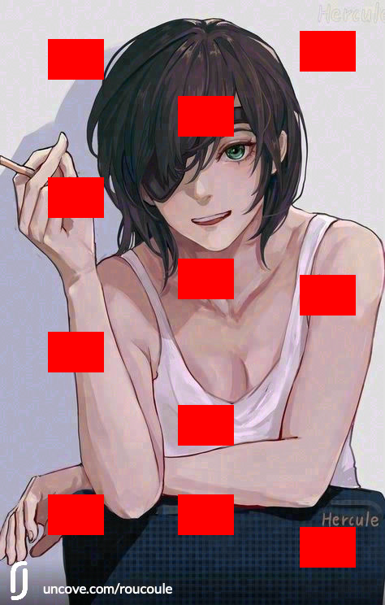
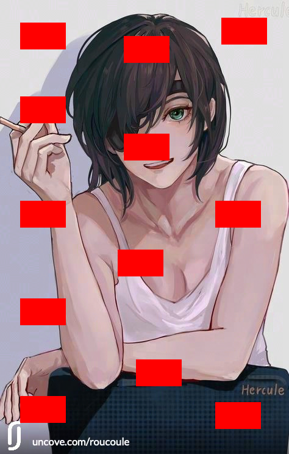
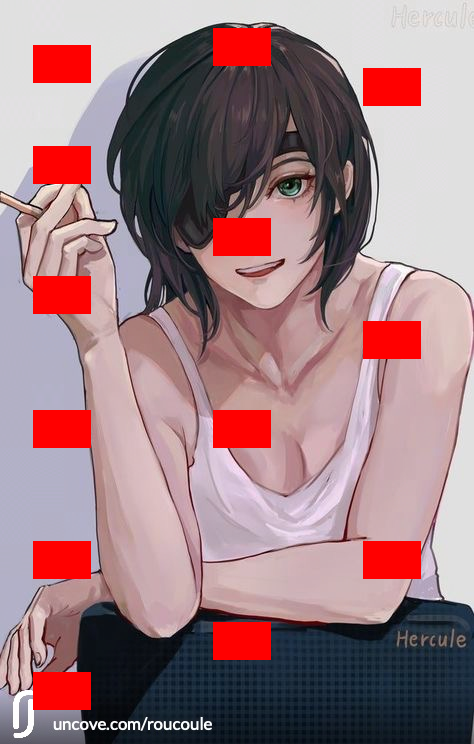

# 1/07/2022 - Premiers test d’optimisations

Created: July 1, 2022 9:31 AM
Tags: Daily, Semaine-3

## **Table de contenu**

---

## 👨🏻‍🤝‍👨🏻 Meeting

Je dois chercher dans le code pour essayer de modifier la solution pour trouver un juste milieu entre performance et solidité.

**Tâche du jour :**

- [x] Implémenter le timer
- [ ] Modifier les valeurs et documenter l’impact sur la performance

<!--truncate-->

# ⚙️ Début d’optimisations de la solution

[https://github.com/Jclouxdev/uncove_invisible_watermark](https://github.com/Jclouxdev/uncove_invisible_watermark)

## ⏰ Premier test : Vérifier que le timer fonctionne

_Un ID user fait 9 caractères. La solution doit donc accepter des chaines de 9 caractères._

Je dockerise la solution comme pour le test précedent afin de pouvoir l’utiliser de façon plus simple sur différents OS.

Pour lancer la solution :

`docker-compose build && docker-compose run --rm python bash`

Je peux ensuite lancer un script créé pour executer le code comme précisé sur le git :

`efficacity_test.py`

```python
import time
from blind_watermark.blind_watermark import WaterMark

startTimer = time.time()
bwm1 = WaterMark(password_img=1, password_wm=1)
bwm1.read_img('/usr/src/app/examples/pic/uncove_pic.webp')
wm = '0123456789'
bwm1.read_wm(wm, mode='str')
bwm1.embed('/usr/src/app/examples/output/embedded.jpeg')
len_wm = len(bwm1.wm_bit)
endTimer = time.time()
execTime = endTimer - startTimer
print('Executed in ', round(execTime, 2), 's')
print('- - - - - - - - - - - - - - - - - - - - - - -')
print('Put down the length of wm_bit {len_wm}'.format(len_wm=len_wm))
print('- - - - - - - - - - - - - - - - - - - - - - -')
```

Je lance donc mon script avec `python3 efficacity_test[.py](http://start.py)` ce qui nous donne :

```python
root@dc6187b5a6a7:/usr/src/app# python3 start.py

Welcome to use blind-watermark, version = 0.4.1
Make sure the version is the same when encode and decode
Your star means a lot: https://github.com/guofei9987/blind_watermark
This message only show once. To close it: `blind_watermark.bw_notes.close()`

Executed in  2.38 s
- - - - - - - - - - - - - - - - - - - - - - -
Put down the length of wm_bit 78
- - - - - - - - - - - - - - - - - - - - - - -
```

Script d’extraction `[extract.py](http://extract.py)`

```python
from blind_watermark.blind_watermark import WaterMark

bwm1 = WaterMark(password_img=1, password_wm=1)
# image_input = input('Name.extension of the image you want to extract : ')
# user_input = input('Length of wm_bit : ')
# build_url = '/usr/src/app/examples/output/' + image_input
# print(build_url)
# wm_extract = bwm1.extract(build_url, wm_shape=int(user_input), mode='str')
wm_extract = bwm1.extract('/usr/src/app/examples/output/embedded-color-filter-10.webp', wm_shape=78, mode='str')
print('')
print('WaterMark extracted :', wm_extract)
print('')
```

**✅ Le timer est donc fonctionnel**

## ⚙️ Début des modifications de l’algo

### Première variable : `block_shape`

Elle correspond aux nombres de pixels contenu dans le carré traité (Par défault dans le code 4x4). Plus on la monte, plus le traitement est censé être rapide. Mais il faut voir quel impact cela a sur la WaterMark.

**Execution sur une image de 474 × 744px**

**4x4 :**

`self.block_shape = np.array([4, 4])`

**Insertion :**

- ✅ Image de base

```python
Executed in  1.26 s
- - - - - - - - - - - - - - - - - - - - - - -
Put down the length of wm_bit 78
- - - - - - - - - - - - - - - - - - - - - - -

WaterMark extracted : 0123456789
```


**Extractions** :

- ✅ Image Horizontal Crop :

```python
Name.extension of the image you want to extract : embedded-h-crop.webp
Length of wm_bit : 78
/usr/src/app/examples/output/embedded-h-crop.webp

WaterMark extracted : 0123456789
```


- ✅ Image Vertical Crop :

```python
Name.extension of the image you want to extract : embedded-v-crop.webp
Length of wm_bit : 78
/usr/src/app/examples/output/embedded-v-crop.webp

WaterMark extracted : 0123456789
```


- ✅ Image Partial Cover

```python
Name.extension of the image you want to extract : embedded-partial-cover.webp
Length of wm_bit : 78
/usr/src/app/examples/output/embedded-partial-cover.webp

WaterMark extracted : 0123456789
```



- ❌ Image Resize

```python
Name.extension of the image you want to extract : embedded-resize.webp
Length of wm_bit : 78
/usr/src/app/examples/output/embedded-resize.webp

WaterMark extracted :  �-b&�^�
```


- ✅ Image Color Filter 10%

```python
Name.extension of the image you want to extract : embedded-color-filter-10.webp
Length of wm_bit : 78
/usr/src/app/examples/output/embedded-color-filter-10.webp

WaterMark extracted : 0123456789
```


- ✅ Image Color Filter 20%

```python
Name.extension of the image you want to extract : embedded-color-filter-20.webp
Length of wm_bit : 78
/usr/src/app/examples/output/embedded-color-filter-20.webp

WaterMark extracted : 0123456789
```


- ✅ Image Color Filter 30%

```python
Name.extension of the image you want to extract : embedded-color-filter-30.webp
Length of wm_bit : 78
/usr/src/app/examples/output/embedded-color-filter-30.webp

WaterMark extracted : 0123456789
```


- ✅ Image Luminosité -20

```python
Name.extension of the image you want to extract : embedded-luminosity-10.webp
Length of wm_bit : 78
/usr/src/app/examples/output/embedded-luminosity-10.webp

WaterMark extracted : 0123456789
```


- ✅ Image Luminosité -50

```python
Name.extension of the image you want to extract : embedded-luminosity-50.webp
Length of wm_bit : 78
/usr/src/app/examples/output/embedded-luminosity-50.webp

WaterMark extracted : 0123456789
```


- ❌ Image Flip

```python
Name.extension of the image you want to extract : embedded-flip.webp
Length of wm_bit : 78
/usr/src/app/examples/output/embedded-flip.webp

WaterMark extracted : �c�^+�N�6
```


**8x8 :**

`self.block_shape = np.array([8, 8])`

**Insertion :**

- ✅ Image de base

```python
Executed in  0.83 s
- - - - - - - - - - - - - - - - - - - - - - -
Put down the length of wm_bit 78
- - - - - - - - - - - - - - - - - - - - - - -

WaterMark extracted :  0123456789
```


**Extractions** :

- ✅ Image Horizontal Crop :

```python
Name.extension of the image you want to extract : embedded-h-crop.webp
Length of wm_bit : 78
/usr/src/app/examples/output/embedded-h-crop.webp

WaterMark extracted : 0123456789
```


- ❌ Image Vertical Crop :

```python
Name.extension of the image you want to extract : embedded-v-crop.webp
Length of wm_bit : 78
/usr/src/app/examples/output/embedded-v-crop.webp

WaterMark extracted : R�P^��
```


- ✅ Image Partial Cover

```python
Name.extension of the image you want to extract : embedded-partial-cover.webp
Length of wm_bit : 78
/usr/src/app/examples/output/embedded-partial-cover.webp

WaterMark extracted : 0123456789
```



- ❌ Image Resize

```python
Name.extension of the image you want to extract : embedded-resize.webp
Length of wm_bit : 78
/usr/src/app/examples/output/embedded-resize.webp

WaterMark extracted :  �-b&�^�
```


- ❌ 🐛 Image Color Filter 20%

```python
WaterMark extracted : #�0J���v�
```


- ❌ 🐛 ScreenShot

```python
Name.extension of the image you want to extract : embedded-screen.png
Length of wm_bit : 78
/usr/src/app/examples/output/embedded-screen.png
Traceback (most recent call last):
  File "/usr/src/app/extract.py", line 8, in <module>
    wm_extract = bwm1.extract(build_url, wm_shape=int(user_input), mode='str')
  File "/usr/src/app/blind_watermark/blind_watermark.py", line 107, in extract
    wm = bytes.fromhex(hex(int(byte, base=2))[2:]).decode('utf-8', errors='replace')
ValueError: non-hexadecimal number found in fromhex() arg at position 19
```

- ❌ Image Luminosité -20

```python
Name.extension of the image you want to extract : embedded-luminosity-50.webp
Length of wm_bit : 78
/usr/src/app/examples/output/embedded-luminosity-50.webp

WaterMark extracted : 0123$52789
```


- ❌ Image Flip

```python
Name.extension of the image you want to extract : embedded-flip.webp
Length of wm_bit : 78
/usr/src/app/examples/output/embedded-flip.webp

WaterMark extracted : �c�^+�N�6
```


**16x16 :**

`self.block_shape = np.array([16, 16])`

**Insertion :**

- ✅ Image de base

```python
Executed in  0.62 s
- - - - - - - - - - - - - - - - - - - - - - -
Put down the length of wm_bit 78
- - - - - - - - - - - - - - - - - - - - - - -

WaterMark extracted :  0123456789
```


**Extractions** :

- ✅ Image Horizontal Crop :

```python
Name.extension of the image you want to extract : embedded-h-crop.webp
Length of wm_bit : 78
/usr/src/app/examples/output/embedded-h-crop.webp

WaterMark extracted : 0123456789
```


- ❌ 🐛 Image Vertical Crop :

```python
Name.extension of the image you want to extract : embedded-v-crop.webp
Length of wm_bit : 78
/usr/src/app/examples/output/embedded-v-crop.webp
Traceback (most recent call last):
  File "/usr/src/app/extract.py", line 8, in <module>
    wm_extract = bwm1.extract(build_url, wm_shape=int(user_input), mode='str')
  File "/usr/src/app/blind_watermark/blind_watermark.py", line 107, in extract
    wm = bytes.fromhex(hex(int(byte, base=2))[2:]).decode('utf-8', errors='replace')
ValueError: non-hexadecimal number found in fromhex() arg at position 19
```


- ✅ Image Partial Cover

```python
Name.extension of the image you want to extract : embedded-partial-cover.webp
Length of wm_bit : 78
/usr/src/app/examples/output/embedded-partial-cover.webp

WaterMark extracted : 0123456789
```



- ❌ Image Resize

```python
Name.extension of the image you want to extract : embedded-resize.webp
Length of wm_bit : 78
/usr/src/app/examples/output/embedded-resize.webp

WaterMark extracted :  �-b&�^�
```


- ❌ 🐛 Image Color Filter 20%

```python
WaterMark extracted : #�0J���v�
```


- ❌ 🐛 ScreenShot

```python
Name.extension of the image you want to extract : embedded-screen.png
Length of wm_bit : 78
/usr/src/app/examples/output/embedded-screen.png
Traceback (most recent call last):
  File "/usr/src/app/extract.py", line 8, in <module>
    wm_extract = bwm1.extract(build_url, wm_shape=int(user_input), mode='str')
  File "/usr/src/app/blind_watermark/blind_watermark.py", line 107, in extract
    wm = bytes.fromhex(hex(int(byte, base=2))[2:]).decode('utf-8', errors='replace')
ValueError: non-hexadecimal number found in fromhex() arg at position 19
```

- ❌ Image Luminosité -20

```python
WaterMark extracted : 35�5456w<0
```


- ❌ Image Flip

```python
Name.extension of the image you want to extract : embedded-flip.webp
Length of wm_bit : 78
/usr/src/app/examples/output/embedded-flip.webp

WaterMark extracted : �c�^+�N�6
```


---

# ☀️ Conclusion du jour

La piste pour **améliorer la performance de la solution** en jouant avec **la taille des carrés de pixels** que l’ont utilise pour la manipulation d’insertion de la Watermark (Souvent 8x8 par défault) est correct, elle fait cependant perdre en solidité face aux attaques.

Retrouvez les tests plus haut.

## **Objectifs pour la suite :**

- [ ] Tester de modifier d’autres paramètres
- [ ] Repenser l’extracteur pour qu’il soit plus simple d’utilisation pour améliorer la vitesse de test
- [ ] Créer un script de modification avec Photoshop pour éditer les photos à la chaine et ne pas avoir à le faire à la main
